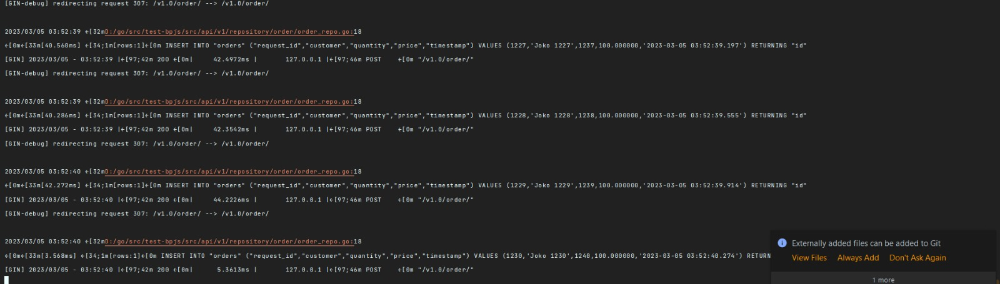
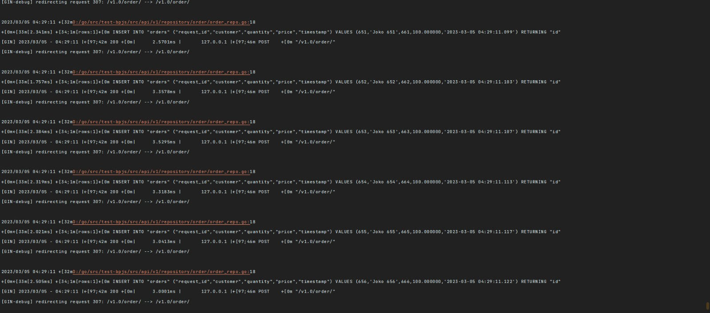

JSON Request:

````
{
    "request_id" :123,
    "data" : [
        {
            "customer" : "ridho",
            "quantity": 1,
            "price" : 10.00
        },
        {
            "customer" : "ridho1",
            "quantity": 1,
            "price" : 10.00
        }
    ]
}
````

JSON Response:

````
{
    "message": "Orders created successfully"
}
````


Image Response API and Log :





